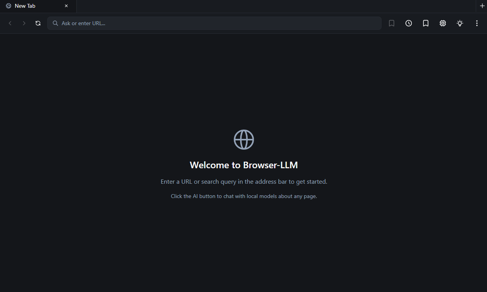
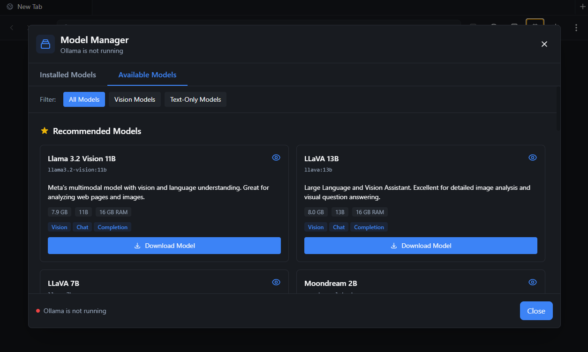
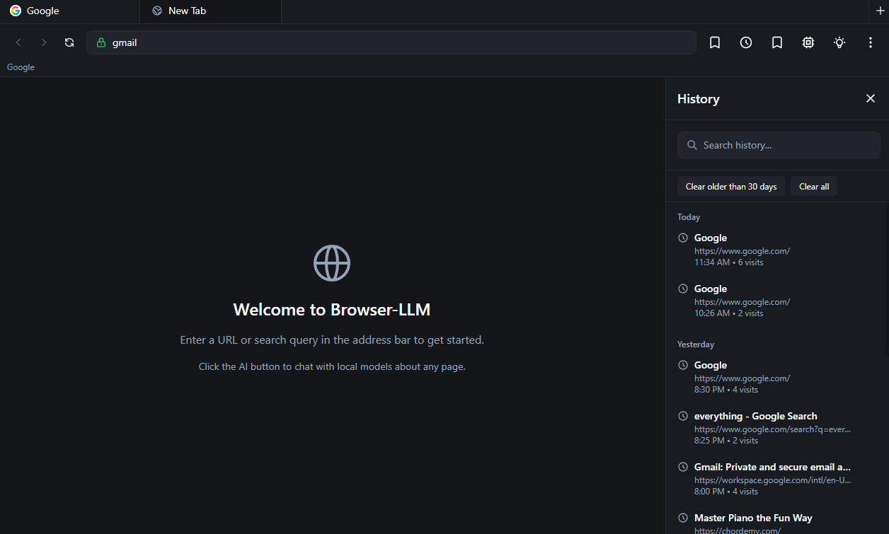

# Open Browser

A Chromium-based browser with integrated local LLM capabilities for intelligent web interaction.

## Screenshots

<p align="center">
  
  
</p>

<p align="center">
  
  
</p>

## Features

### Currently Available

#### Core Browser Features
- 🌐 Full-featured Chromium browser with multi-tab support
- 📑 Tab management with keyboard shortcuts (Ctrl+T, Ctrl+W, Ctrl+Tab)
- 🔍 Navigation controls (back, forward, reload, home)
- 📚 History tracking with searchable sidebar
- ⭐ Bookmarks management system
- 🎯 Context menus with right-click support
- ⚙️ Tab suspension for better memory management
- 🔐 Comprehensive security hardening with context isolation
- 🛠️ Developer tools integration (F12)
- 📄 Page printing and source viewing
- 🔎 Zoom controls (Ctrl +/-/0)
- 💾 Tab persistence and crash recovery

#### AI & LLM Features
- 🤖 Ollama/LLM integration with streaming inference
- 💬 Chat sidebar for AI conversations with model capability detection
- ⚡ Comprehensive model manager with download progress tracking
- 🎯 Vision-capable and text-only model support
- 🚀 Automatic GPU acceleration (CUDA, ROCm, Metal)
- ⭐ Default model selection and persistent settings
- 🎭 **AI Personality Selection** - 26 unique personalities across 4 categories:
  - Professional (Business Analyst, Technical Expert, Life Coach, etc.)
  - Friends (Best Friend, Study Buddy, Workout Partner, etc.)
  - Funny (Stand-up Comedian, Sarcastic Friend, Meme Lord, etc.)
  - Romantic (Various caring, adventurous, and supportive partners)
- 🧠 **Context-Aware AI** - Smart context optimization with:
  - Page content capture and analysis
  - Browsing history context injection
  - Bookmarks context injection
  - Token estimation and optimization
- 📸 **Vision Model Integration** - Screenshot capture for vision-capable models
- 🛠️ **Tool Calling/Agent Mode** - AI can interact with browser through 6 tools:
  - Search history
  - Access bookmarks
  - Analyze page content
  - Capture screenshots
  - Get page metadata
  - Perform web searches
- 🤔 **Advanced Reasoning** - Chain-of-thought support with thinking token streaming
- 💭 **Custom System Prompts** - Personalize AI behavior with custom instructions

#### Download Management
- 📥 **Comprehensive Download Manager** with:
  - Real-time download progress tracking
  - Pause/resume/cancel functionality
  - Download history with categorization (active, completed, failed)
  - File type information and metadata
  - Download speed and time estimation
  - Open files and show in folder
  - Automatic cleanup of old downloads

#### Privacy & Security
- 🔒 **Mandatory User Agreement** - One-time comprehensive disclosure covering:
  - Local data storage (no cloud transmission)
  - Model behavior and content disclaimers
  - AI model context access
  - Zero telemetry or data collection
- 🛡️ **Privacy-First Design** - All data stored locally, no external transmission
- 🔐 Advanced security hardening with sandboxing and validation

### Planned Features

- 🏷️ Smart bookmarking with AI categorization
- 🔍 Semantic search across browsing history
- 📊 Enhanced page summarization with readability optimization
- 🌐 Multi-language support for UI
- 📱 Mobile companion app
- 🔄 Sync across devices (optional, privacy-preserving)

## Tech Stack

- **Electron** - Desktop app framework with embedded Chromium
- **React + TypeScript** - UI components with modern hooks
- **Vite** - Fast build tool with Hot Module Replacement
- **Tailwind CSS** - Utility-first styling
- **Zustand** - Lightweight state management
- **Better-SQLite3** - Local database for history and bookmarks
- **Axios** - HTTP client for Ollama API communication
- **ESLint + Prettier** - Code quality and formatting
- **Husky** - Git hooks for pre-commit checks
- **Ollama** - Local LLM inference engine (v0.12.9 bundled with application)

## Development

### Prerequisites

- Node.js 18+ (LTS recommended)
- npm or pnpm

**Note:** Ollama is bundled with the application - no separate installation required!

### Getting Started

```bash
# Install dependencies
# This automatically downloads Ollama binaries (~1.8GB)
npm install

# If you need to manually download/update Ollama binaries
npm run setup:ollama

# Start development server
# Ollama will start automatically with the app
npm run dev

# Build for production
npm run build

# Package as distributable (includes Ollama)
npm run package
```

**First-time setup:**

- When you run `npm install`, the Ollama binaries will be automatically downloaded
- This is a one-time download of ~1.8GB (includes Windows and macOS versions)
- The binaries are stored in `resources/bin/` (excluded from git)

### Using AI Features

The application includes **Ollama v0.12.9** bundled for both Windows and macOS. When you first run the app:

1. Ollama starts automatically in the background
2. Click the Model Manager button in the navigation bar (or press Ctrl/Cmd+M)
3. Download your preferred model (e.g., llama3.2, qwen2.5)
4. Start chatting with AI or analyzing web pages!

No manual Ollama installation or configuration needed.

#### Bundled Ollama Version

- **Version**: 0.12.9 (Released: November 1, 2025)
- **Platforms**: Windows (x64), macOS (Intel + Apple Silicon)
- **Size**: ~1.8GB (includes CUDA, ROCm support for GPU acceleration)
- **Update Instructions**: To update Ollama, download the latest release from [ollama/ollama/releases](https://github.com/ollama/ollama/releases) and replace files in `resources/bin/`

## Project Structure

```
open-browser/
├── src/
│   ├── main/              # Electron main process
│   │   ├── ipc/          # IPC handlers for renderer communication
│   │   ├── services/     # Backend services (database, ollama)
│   │   └── utils/        # Validation and utilities
│   ├── renderer/          # React UI
│   │   ├── components/   # React components (Browser, Chat, etc.)
│   │   ├── store/        # Zustand state management (browser, chat, models)
│   │   └── services/     # Frontend services
│   └── shared/           # Shared types and utilities
├── .github/              # GitHub configuration and workflows
└── TECH_BRIEFING.md     # Comprehensive technical documentation
```

## Documentation

See [TECH_BRIEFING.md](./TECH_BRIEFING.md) for comprehensive technical documentation including:

- Architecture diagrams
- API integration patterns
- Model registry format
- Security considerations
- Performance optimization

## Current Status

🚀 **Active Development** - Full-featured browser with comprehensive AI integration, including personality selection, vision models, tool calling, and advanced download management

### Completed

#### Core Infrastructure
- [x] Electron + React + TypeScript setup
- [x] Vite build configuration with HMR
- [x] Security hardening implementation
- [x] Browser UI with navigation and multi-tab support
- [x] Tab management (create, close, switch, suspend)
- [x] Tab persistence and crash recovery
- [x] History tracking and searchable sidebar
- [x] Bookmarks management system
- [x] SQLite database integration
- [x] Context menus and keyboard shortcuts
- [x] Code quality tooling (ESLint, Prettier, Husky)
- [x] CI/CD with GitHub Actions

#### AI & LLM Integration
- [x] Ollama service integration with auto-start capability
- [x] Chat interface with streaming message support
- [x] Comprehensive model manager UI with tabs
- [x] Model registry with 12+ pre-configured models
- [x] Vision vs text-only model capability tracking
- [x] Download progress tracking with real-time updates
- [x] Default model selection with persistent storage
- [x] Model metadata display (size, parameters, capabilities)
- [x] GPU acceleration support (automatic detection)
- [x] IPC handlers for secure LLM operations
- [x] Chat and Model state management with Zustand

#### New Advanced Features
- [x] **AI Personality Selection** - 26 personalities across 4 categories
- [x] **Context-Aware AI** - Smart context optimization with page analysis
- [x] **Vision Model Integration** - Screenshot capture and analysis
- [x] **Tool Calling/Agent Mode** - 6 browser interaction tools
- [x] **Advanced Reasoning** - Chain-of-thought with thinking tokens
- [x] **Custom System Prompts** - User-defined AI behavior
- [x] **Comprehensive Download Manager** - Full download lifecycle management
- [x] **Mandatory User Agreement** - One-time privacy and terms disclosure
- [x] **Content Capture Service** - Page text and DOM extraction
- [x] **Page Context Extraction** - Smart content summarization

### In Progress / Planned

- [ ] Smart bookmarking with AI categorization
- [ ] Semantic search across browsing history
- [ ] Enhanced page summarization with readability optimization
- [ ] Multi-language support for UI

## Keyboard Shortcuts

| Shortcut               | Action                   |
| ---------------------- | ------------------------ |
| `Ctrl/Cmd + T`         | New tab                  |
| `Ctrl/Cmd + W`         | Close current tab        |
| `Ctrl + Tab`           | Switch to next tab       |
| `Ctrl + Shift + Tab`   | Switch to previous tab   |
| `Ctrl/Cmd + R` or `F5` | Reload page              |
| `Ctrl/Cmd + H`         | Toggle history sidebar   |
| `Ctrl/Cmd + B`         | Toggle bookmarks sidebar |
| `Ctrl/Cmd + M`         | Open model manager       |
| `Alt + Left`           | Go back                  |
| `Alt + Right`          | Go forward               |
| `Ctrl/Cmd + Plus`      | Zoom in                  |
| `Ctrl/Cmd + Minus`     | Zoom out                 |
| `Ctrl/Cmd + 0`         | Reset zoom               |
| `Ctrl/Cmd + P`         | Print page               |
| `Ctrl/Cmd + U`         | View page source         |
| `F12`                  | Open developer tools     |
| `Escape`               | Stop page loading        |

## Contributing

Contributions are welcome! Please feel free to submit a Pull Request. For major changes, please open an issue first to discuss what you would like to change.

### Development Guidelines

1. Fork the repository
2. Clone your fork: `git clone https://github.com/your-username/browser-llm.git`
3. Install dependencies: `npm install` (this will download Ollama binaries automatically)
4. Create your feature branch (`git checkout -b feature/amazing-feature`)
5. Make your changes
6. Run linting and formatting: `npm run lint:fix && npm run format`
7. Commit your changes with a descriptive message
8. Push to your branch (`git push origin feature/amazing-feature`)
9. Open a Pull Request

**Note:** The `resources/bin/` directory is excluded from git. Contributors will automatically download Ollama binaries when running `npm install`.

The project uses:

- **ESLint** for code linting
- **Prettier** for code formatting
- **Husky** for pre-commit hooks
- **lint-staged** for running checks on staged files

All PRs must pass the automated checks before merging.

## License

MIT
